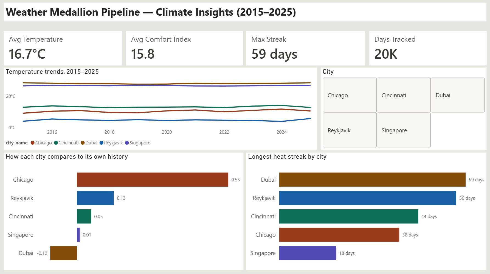
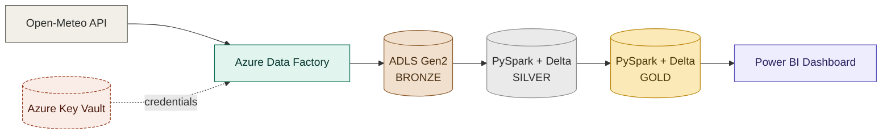
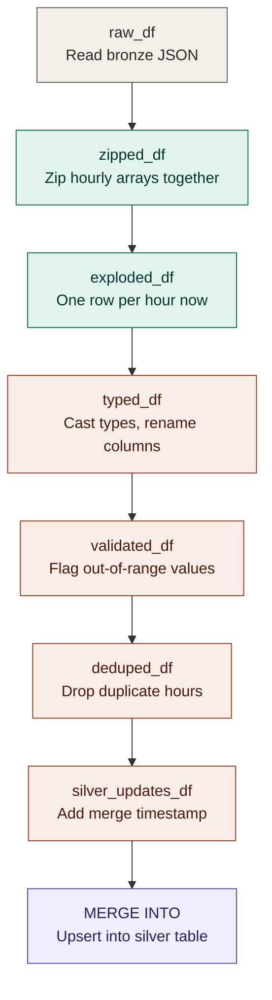
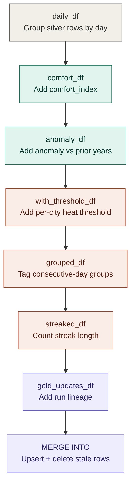

# Fabric Weather Medallion Pipeline

End-to-end data engineering pipeline: public weather API → Azure Data Factory → ADLS Gen2 (bronze) → medallion transformation (silver/gold) → Power BI semantic model.

**Status:** ✅ Complete — bronze, silver, gold, and a Power BI dashboard are built, validated, and documented.

## Overview

Eleven years (2015–2025) of hourly weather data for 5 cities (Cincinnati, Chicago, Dubai, Reykjavik, Singapore) flow through a medallion architecture: raw API ingestion, incremental cleaning/validation, and business-logic aggregation (comfort index, historical anomaly, heat streaks), landing in a Power BI dashboard.

**Key numbers:**
- 482,160 raw hourly observations in silver (96,432 per city — exact, verified, zero duplicates/gaps)
- 20,090 daily aggregates in gold (4,018 days × 5 cities)
- 7 DAX measures, 3 relationships, 1 semantic model built via MCP-driven modeling on Power BI Desktop



## Architecture



Bronze, silver, and gold are colored to literally match their names — not just a naming convention, an actual visual medallion.

Credentials for the ADF↔storage connection are managed via Azure Key Vault. The silver/gold notebooks currently run against local PySpark + Delta Lake rather than Fabric Lakehouse — a licensing/access constraint, not a design choice; full story in [`docs/design-decisions.md`](docs/design-decisions.md).

## Repo structure

```
├── docs/                    # design decisions, data dictionary, retrospective, code diagrams
├── adf/                     # exported ADF pipelines, datasets, linked services
├── fabric/notebooks/        # PySpark notebooks (bronze→silver, silver→gold) — Fabric target
├── local/                   # local PySpark execution path (README explains why + how)
├── powerbi/                 # .pbix dashboard + DAX measure docs
└── sql/ddl/                 # table definitions for silver/gold layers
```

## Key engineering decisions

- **Incremental loading**, not full reload — watermark-based extraction with `MERGE INTO` upserts at the silver layer, verified with exact row counts across multiple runs
- **Error handling & logging** — retry policies in ADF, centralized `etl_run_log` control table
- **Data quality validation** — range checks and null flagging at silver, not silent drops
- **Lookahead bias caught and fixed in gold** — the historical anomaly baseline originally leaked future years into "historical" averages; caught in a self-review pass, fixed with an expanding prior-years-only window, and verified by hand against a specific row
- **Local execution over Fabric**, by necessity not preference — see [`docs/design-decisions.md`](docs/design-decisions.md) for the full account of the licensing obstacles that led here, and the path back to Fabric when access is available

### 🧰 Stack

Tools listed here were actually used and verified in this project — no badge without evidence in the repo.

**Cloud & Data Platform**
<p>
  
  
  
  
</p>

**Security**
<p>
  
</p>

**BI & Modeling**
<p>
  
  
</p>

**Languages & Processing**
<p>
  
  
  
  
</p>

**AI-Assisted Engineering**
<p>
  
  
  
</p>

Used for architecture/design discussion, debugging ADF and PySpark issues, and — notably — building the Power BI semantic model (tables, relationships, DAX measures) programmatically via an MCP server connected directly to a local Power BI Desktop instance, rather than manual UI-only modeling.

**Tooling**
<p>
  
  
</p>

## What I would do differently

See [`docs/what-i-would-do-differently.md`](docs/what-i-would-do-differently.md).

---

## Deep dive: silver transformation, step by step

*(Optional detail below — the sections above are enough to understand the project. This is here for anyone who wants to see exactly how the bronze JSON becomes clean rows.)*

The bronze JSON arrives with weather values packed into parallel arrays (`hourly.time`, `hourly.temperature_2m`, ...). Turning that into one row per hour is the core of the silver-layer notebook — traced below by variable name, matching `local/local_bronze_to_silver.py` exactly. (Full writeup, plus a call-graph attempt that turned up empty for a good reason, in [`docs/code-diagrams/`](docs/code-diagrams/).)



**What's happening at each step:**
1. **`raw_df`** — read the raw JSON files, one per city/date, straight off ADLS
2. **`zipped_df`** — `hourly.time`, `hourly.temperature_2m`, etc. arrive as separate parallel arrays; `arrays_zip` pairs them up by position into one array of structs
3. **`exploded_df`** — `explode` turns that one array (still a single row) into one row per hour — this is the actual "unpacking" step
4. **`typed_df`** — cast raw strings/numbers to proper types, rename to the final column names
5. **`validated_df`** — flag rows with out-of-range values (`is_valid`) instead of dropping them, so bad data stays visible for review
6. **`deduped_df`** — drop exact duplicate `(location_id, observation_datetime)` rows, in case a file gets reprocessed
7. **`silver_updates_df`** — stamp every row with `_merged_at` for this run
8. **`MERGE INTO`** — upsert into `silver.weather_observations`: update rows that already exist, insert the ones that don't

## Deep dive: gold transformation, step by step

*(Also optional — matches `local/local_silver_to_gold.py` exactly.)*

Gold reads all of silver and recomputes the daily fact table from scratch every run (not incrementally) — `anomaly_vs_historical_avg` and `streak_days_above_threshold` are both cross-row calculations over a location's full history, so there's no correct way to compute them one row at a time.



**What's happening at each step:**
1. **`daily_df`** — group silver's hourly rows by `(location_id, day)`, averaging temperature/humidity/wind down to one row per city per day
2. **`comfort_df`** — apply the project's comfort-index heuristic (a documented approximation, not an official meteorological formula): adjusts for humidity above 20°C, for wind below 10°C, and passes through unchanged in between
3. **`anomaly_df`** — the step that had the lookahead-bias bug: for each `(location, month, day)`, average `avg_temperature_c` across *years strictly before* the one being evaluated (an expanding window ordered by year), so a 2016 row is never compared against 2020-2035 data it couldn't have known about yet
4. **`with_threshold_df`** — compute each city's own heat threshold (its mean temperature + 1 standard deviation), so "hot" means something different in Reykjavik than in Dubai
5. **`grouped_df`** — a gaps-and-islands trick: subtract two row-number sequences to give every consecutive run of "above threshold" days a stable group id
6. **`streaked_df`** — count each day's position within its own streak group, giving `streak_days_above_threshold`
7. **`gold_updates_df`** — stamp every row with `pipeline_run_id` and `_computed_at`
8. **`MERGE INTO`** — upsert matching rows, insert new ones, **and delete** any `(location_id, date_id)` no longer backed by a valid silver row — safe here specifically because gold is a full recompute, so anything missing from the source is genuinely stale

## Author

Kendall Castro — [GitHub](https://github.com/KendallCW)
