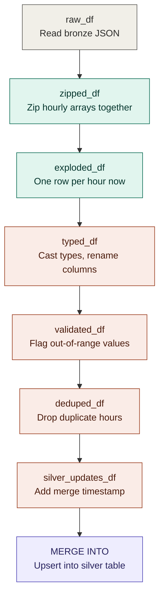

# Data flow: bronze → silver transformation

Unlike a call graph (see [`silver_gold_call_graph.md`](silver_gold_call_graph.md), which came back empty because this script is procedural, not function-based), this diagram traces how the **DataFrame itself** changes shape at each step — variable name by variable name, matching `local/local_bronze_to_silver.py` exactly.

- **Gray** — read the raw bronze JSON
- **Teal** — the `arrays_zip` + `explode` pair that turns parallel hourly arrays into one row per hour (the step that took the most work to build intuition for)
- **Coral** — cleanup: typing, validation, deduplication, and adding the merge timestamp
- **Purple** — the final `MERGE INTO` upsert into `silver.weather_observations`

