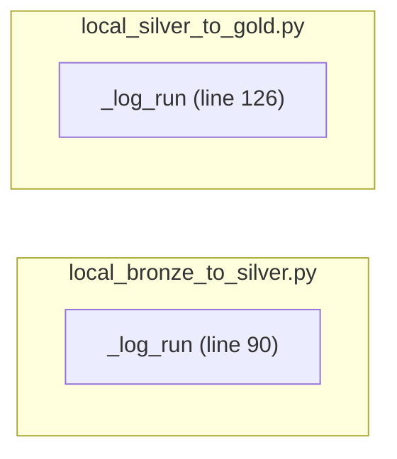

# Call graph: local_bronze_to_silver.py / local_silver_to_gold.py

Generated via [Noodles](https://github.com/unslop-xyz/noodles) AST-based call-graph analysis (`analyze_local_repo`, analysis_id `d2af1fe12fe6`).

**Result: 2 orphan nodes, 0 edges.** Both scripts are almost entirely module-level procedural code (Spark DataFrame transformations chained inline) rather than user-defined functions calling each other. The only function either script defines is `_log_run` (writes to `etl_run_log`), and neither script's own code calls it as part of a traced call chain the AST parser follows — hence "orphan." This is the true shape of the code, not a tool limitation: a sparse call graph is the expected result for notebook-style scripts.

